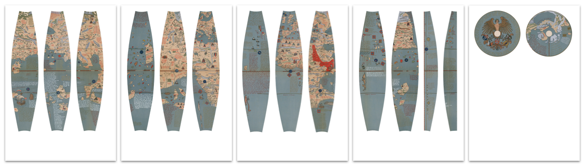

# erdapfel-papercraft

Print your own 1492 [Erdapfel](https://en.wikipedia.org/wiki/Erdapfel)!

## Attribution

The contents of `textures_raw.tar.gz` are from the _David Rumsey Map Collection_ (Cartography Associates). Specifically the download link (Full Image Download...) from the following pages:

* [Globe Gores 1.](https://www.davidrumsey.com/luna/servlet/detail/RUMSEY~8~1~291865~90063406:Globe-Gores--1--Martin-Behaim-s-Erd)
* [Globe Gores 2.](https://www.davidrumsey.com/luna/servlet/detail/RUMSEY~8~1~291866~90063409:Globe-Gores--2--Martin-Behaim-s-Erd)
* [Globe Gores 3.](https://www.davidrumsey.com/luna/servlet/detail/RUMSEY~8~1~291867~90063408:Globe-Gores--3--Martin-Behaim-s-Erd)
* [Globe Gores 4.](https://www.davidrumsey.com/luna/servlet/detail/RUMSEY~8~1~291868~90063407:Globe-Gores--4--Martin-Behaim-s-Erd)

## Tools requires 

This project has a farrago of dependencies. Sorry.

* A unix-system.
* Git LFS to download an archive.
* `tar` to unzip an archive.
* GDAL (`gdal_translate`) for fixing a corrupt image.
* ImageMagick (`magick`) for extracting images.
* Python + Poetry
    * Run `poetry install` to install dependencies.

## Generating results

```commandline
% make masks_png
% make textures_raw
% make textures_masked
% make printout_a4_20cm
```

For alternative printout sizes, `printout.py` accepts different parameters.
So instead of `make printout_a4_20cm` you can directly pass in parameters: 

```commandline
% poetry run python printout.py                     
printout.py [width] [height] [diameter] [margin] [sep]
  [width]:     Width of PDF in cm (A4 = 21.0)
  [height]:    Height of PDF in cm (A4 = 29.7)
  [diameter]:  Diameter of printed globe in cm
  [margin]:    Margins of the PDF in cm
  [sep]:       Blank space separation between textures in cm

Example: printout.py 21.0 29.7 20.0 0.5 0.5
```

